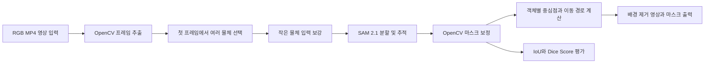

# 1. 프로젝트 개요

## 1.1. 기본 정보

- 프로젝트 제목: **SAM 2를 활용한 영상 속 다중 객체 및 작은 물체 분할·추적**
- 작성일자: **2026-10-05**

# 2. 서론 및 배경

## 2.1. 배경

- 문제 정의: 하나의 영상에는 크기가 서로 다른 여러 물체가 함께 등장한다. 특히 화면에서 차지하는 영역이 작은 물체는 경계가 뚜렷하지 않고 움직임에 따라 형태가 빠르게 달라져 안정적으로 분할하고 추적하기 어렵다. 본 프로젝트에서는 사용자가 첫 화면에서 여러 물체를 선택하면, 선택한 물체들을 영상의 다음 화면에서도 각각 분할하고 추적하는 기능을 구현한다.
- 제안 배경: 참고 프로젝트는 SAM 2를 이용해 영상에서 지정한 물체를 분할하고 배경을 제거한다. 그러나 물체를 선택하는 좌표를 코드에 직접 입력해야 하며, 작은 물체나 여러 물체를 동시에 다루는 기능과 정량적인 정확도 평가는 부족하다. 이를 보완하여 사용자가 마우스로 여러 물체를 선택하고, 작은 물체도 가능한 한 놓치지 않도록 입력 방식을 보강한 프로그램을 만들고자 한다.

## 2.2. 기여점

- 참고 프로젝트 주제: **SAM 2를 이용한 교통사고 영상의 객체 분할·추적 및 배경 제거**
- 기존 프로젝트와의 차별성:
  - 첫 화면에서 좌표를 직접 입력하는 대신 마우스 클릭과 사각형 선택으로 물체를 지정한다.
  - 두 개 이상의 물체를 각각 선택하여 동시에 분할하고 추적한다.
  - 작은 물체는 확대 화면, 좁은 사각형, 추가 점 입력을 사용해 선택 정보를 보강한다.
  - OpenCV로 마스크의 작은 구멍과 경계 잡음을 줄인다.
  - 물체별 중심점과 이동 경로를 화면에 표시한다.
  - 직접 만든 일부 정답 마스크를 이용해 IoU와 Dice Score를 계산하고, 기본 결과와 보정 결과를 비교한다.

# 3. 상세 내용

## 3.1. 개발 목표 및 접근법

- 정량적/정성적 달성 목표:
  - 한 영상에서 두 개 이상의 선택 물체를 서로 다른 객체 ID로 분할하고 추적한다.
  - 작은 물체를 포함한 각 물체의 마스크와 이동 경로를 프레임별로 생성한다.
  - 일부 평가 프레임에 정답 마스크를 직접 만들고 객체별 IoU와 Dice Score를 계산한다.
  - SAM 2의 기본 마스크와 OpenCV 보정 후 마스크를 비교해 작은 구멍과 경계 잡음이 줄었는지 확인한다.
  - 가림, 빠른 움직임, 화면 이탈, 작은 크기 등 실패 상황을 구분하여 결과를 분석한다.
- 핵심 알고리즘 및 접근법:
  - 사전 학습된 **SAM 2.1**의 영상 예측 기능을 사용하므로 새로운 모델을 처음부터 학습하지 않는다.
  - 첫 프레임에서 사용자가 점 또는 사각형으로 여러 물체를 선택하고 객체별 ID를 부여한다.
  - 작은 물체에는 확대된 화면과 추가 점 또는 좁은 사각형 입력을 제공하여 초기 마스크를 보완한다.
  - SAM 2가 이전 프레임의 정보를 참고해 각 물체의 마스크를 다음 프레임으로 전달한다.
  - OpenCV의 형태학적 연산과 연결 요소 분석을 이용해 작은 구멍, 잡음, 불필요한 영역을 정리한다.
  - 정리된 마스크에서 중심점을 계산하고 프레임별 중심점을 연결해 이동 경로를 표시한다.

## 3.2. 시스템 아키텍처

- 파이프라인: **RGB 영상 입력 → 프레임 추출 → 첫 프레임에서 다중 객체 선택 → SAM 2.1 객체별 분할·추적 → OpenCV 마스크 보정 → 중심점 및 이동 경로 계산 → 결과 영상·마스크·평가 지표 출력**

## 3.3. 입출력 인터페이스

- 입력 데이터 형태: 해상도와 길이가 서로 다른 RGB MP4 영상, 첫 프레임에서 입력하는 객체별 점 또는 사각형 정보
- 최종 출력 형태:
  - 선택한 물체만 남기고 배경을 검은색으로 처리한 MP4 영상
  - 객체별 마스크 이미지와 투명 배경 PNG 이미지
  - 객체별 중심점 및 이동 경로가 표시된 영상
  - 평가 프레임의 객체별 IoU와 Dice Score 결과

# 4. 개발 환경

## 4.1. 데이터셋

- 데이터셋 이름: **Real-Time Traffic Accidents Dataset**
- 데이터셋 출처: [Kaggle 데이터셋](https://www.kaggle.com/datasets/islamalattar/real-time-traffic-accidents)
- 데이터 규모: **총 746개 파일, 약 3.21GB**
- 데이터 특징: 교통사고와 비사고 상황을 담은 RGB 이미지 및 MP4 영상으로 구성되어 있다. 사고와 비사고 폴더 구분은 영상 분류용이며 객체 분할 정답 마스크는 제공하지 않는다. 사전 학습된 SAM 2.1을 사용하므로 별도의 Train/Validation/Test 학습 분할은 하지 않고, 선택한 영상 일부에 정답 마스크를 직접 만들어 평가한다. 데이터셋 직접 페이지의 접근 가능 여부와 사용 라이선스는 제출 전에 다시 확인한다.

## 4.2. 실행 환경

- 개발 언어 및 프레임워크: **Python 3.10 이상, PyTorch 2.5.1 이상**
- 라이브러리: **SAM 2, OpenCV, TorchVision, NumPy, Pillow, Matplotlib**
- 연산 환경: **Kaggle Notebook 또는 Linux·WSL 환경, CUDA를 지원하는 NVIDIA GPU 권장**
- 모델 선택: 기본 모델은 **SAM 2.1 Hiera Large**로 시작하되, GPU 메모리가 부족하거나 처리 시간이 길면 Hiera Base+ 또는 Small 모델로 변경한다.

# 5. 수행 계획

## 5.1. 개발 일정

- 6~7주차: 참고 프로젝트 분석, 데이터셋 확보, 실행 환경 구성, SAM 2.1 기본 코드 재현
- 9~12주차: 마우스 기반 다중 객체 선택, 작은 물체 입력 보강, 객체별 분할·추적, 마스크 보정 및 이동 경로 표시 기능 구현
- 12~14주차: 정답 마스크 작성, IoU·Dice Score 측정, 실패 사례 분석, 오류 보완 및 기말 발표 자료 작성

프로젝트 개발 일정은 아래 간트차트에서 확인할 수 있다.

# 6. 참고 문헌

- 논문: [SAM 2: Segment Anything in Images and Videos](https://ai.meta.com/research/publications/sam-2-segment-anything-in-images-and-videos/)
- 오픈소스 저장소: [facebookresearch/sam2](https://github.com/facebookresearch/sam2)
- 참고 Kaggle 프로젝트: [SAM2 Traffic Accident Video Segmentation with Background Removal](https://www.kaggle.com/code/stpeteishii/sam2-traffic-accident-video-seg-w-back-removal/notebook)
- 데이터셋: [Real-Time Traffic Accidents Dataset](https://www.kaggle.com/datasets/islamalattar/real-time-traffic-accidents)
