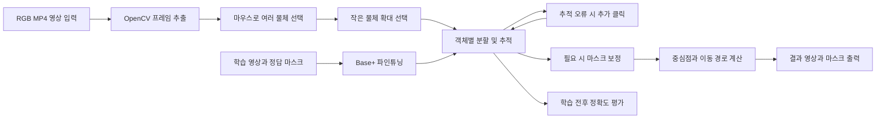

# 1. 프로젝트 개요

## 1.1. 기본 정보

- 프로젝트 제목: **SAM 2.1을 활용한 사용자 선택 기반 영상 다중 객체 분할·추적**
- 작성일자: **2026-10-05**
- 학번 : 20221703
- 이름 : 박준호

# 2. 서론 및 배경

## 2.1. 배경

- 문제 정의: 사용자가 영상에서 선택한 여러 물체를 각각 분할·추적하고, 작은 물체 선택과 추적 오류 수정을 지원한다.
- 제안 배경: SAM 2 기반 분할·배경 제거 프로젝트에 마우스 선택과 다중 객체 추적 기능을 추가하고, 교통 영상으로 파인튜닝한 결과를 비교한다.

## 2.2. 기여점

- 참고 프로젝트 주제: **SAM 2를 이용한 교통사고 영상의 객체 분할·추적 및 배경 제거**
- 기존 프로젝트와의 차별성:
  - 클릭·사각형으로 여러 물체를 선택하고, 서로 다른 번호와 색으로 추적한다.
  - 작은 물체는 확대해 선택하고, 추적 오류는 추가 클릭으로 수정한다.
  - 물체별 중심점과 이동 경로를 표시한다.
  - Base+ 파인튜닝 전후 정확도와 실패 사례를 비교한다.

# 3. 상세 내용

## 3.1. 개발 목표 및 접근법

- 정량적/정성적 달성 목표:
  - 두 개 이상의 물체를 고유 ID로 분할·추적하고, 프레임별 마스크와 이동 경로를 생성한다.
  - 같은 평가 영상과 선택 입력으로 객체별 IoU·Dice Score를 계산해 파인튜닝 전후를 비교한다.
  - 작은 물체, 가림, 빠른 움직임, 화면 이탈에서 물체를 놓치거나 잘못 추적한 사례를 기록한다.
- 핵심 알고리즘 및 접근법:
  - 사전 학습된 **SAM 2.1 Hiera Base+**를 교통 영상과 정답 마스크로 파인튜닝한다.
  - 첫 프레임에서 선택한 물체에 ID를 부여하고, SAM 2.1로 다음 프레임의 마스크를 생성한다.
  - 마스크 중심점을 연결해 이동 경로를 표시한다. 필요 시 OpenCV로 구멍·잡음을 보정하고, 원본과 비교한다.

## 3.2. 시스템 아키텍처

- 파이프라인: **RGB 영상 → 프레임 추출 → 물체 선택 → 파인튜닝한 Base+로 분할·추적 → 마스크 보정 → 중심점·경로 계산 → 결과 출력**

## 3.3. 입출력 인터페이스

- 입력 데이터 형태: RGB MP4 영상과 객체별 클릭·사각형 정보. 학습에는 영상과 정답 마스크를 사용한다.
- 최종 출력 형태:
  - 객체별 번호·색·중심점·이동 경로가 표시된 MP4 영상과 프레임별 마스크
  - 객체별 IoU·Dice Score, 추적 실패 사례와 파인튜닝 전후 비교 결과
  - 부가 기능: 배경 제거 영상과 투명 배경 PNG

# 4. 개발 환경

## 4.1. 데이터셋

- 데이터셋 이름: **Real-Time Traffic Accidents Dataset**
- 데이터셋 출처: [Kaggle 데이터셋](https://www.kaggle.com/datasets/islamalattar/real-time-traffic-accidents)
- 데이터 규모: 원본 기획서 기준 **746개 파일, 약 3.21GB**. 확보 후 확인한다.
- 데이터 특징: 교통사고·비사고 MP4 영상을 골라 정답 마스크를 직접 만든다. 영상이 겹치지 않도록 학습용·검증용·평가용으로 나누어 파인튜닝·모델 선택·최종 비교에 사용한다. 라이선스와 사용 조건을 확인한다.

## 4.2. 실행 환경

- 개발 언어 및 프레임워크: **Python 3.10 이상, PyTorch 2.5.1 이상**
- 라이브러리: **SAM 2, OpenCV, TorchVision, NumPy, Pillow, Matplotlib**
- 연산 환경: **Kaggle Notebook 또는 Linux·WSL, CUDA 지원 NVIDIA GPU**. 작은 데이터로 GPU 메모리와 학습 시간을 확인한다.
- 모델 선택: **SAM 2.1 Hiera Base+**, 사전 학습 가중치에서 시작해 파인튜닝한다.

# 5. 수행 계획

## 5.1. 개발 일정

- 6~7주차: 참고 프로젝트·데이터 확인, 환경 구성과 Base+ 코드 재현
- 9~12주차: 정답 마스크 제작·데이터 분할, 파인튜닝, 다중 객체 선택·추적·경로 표시 구현
- 12~14주차: 확대 선택·오류 수정 점검, IoU·Dice 평가와 학습 전후 비교, 실패 분석·기말 발표 준비

개발 일정은 아래 간트차트와 같다.

# 6. 참고 문헌

- 논문: [SAM 2: Segment Anything in Images and Videos](https://ai.meta.com/research/publications/sam-2-segment-anything-in-images-and-videos/)
- 오픈소스 저장소: [facebookresearch/sam2](https://github.com/facebookresearch/sam2)
- 학습 안내: [SAM 2 공식 파인튜닝 안내](https://github.com/facebookresearch/sam2/blob/main/training/README.md)
- 참고 Kaggle 프로젝트: [SAM2 Traffic Accident Video Segmentation with Background Removal](https://www.kaggle.com/code/stpeteishii/sam2-traffic-accident-video-seg-w-back-removal/notebook)
- 데이터셋: [Real-Time Traffic Accidents Dataset](https://www.kaggle.com/datasets/islamalattar/real-time-traffic-accidents)
